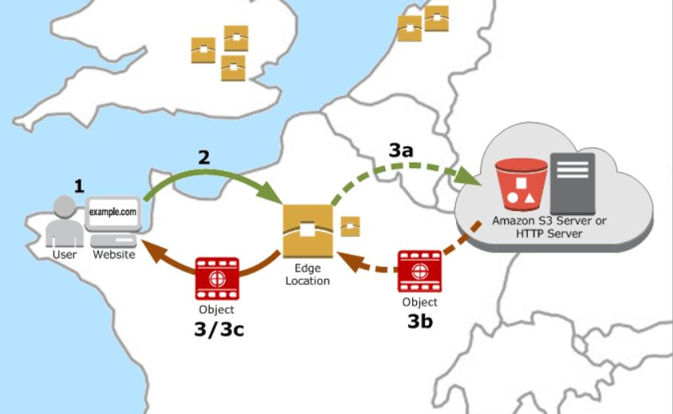
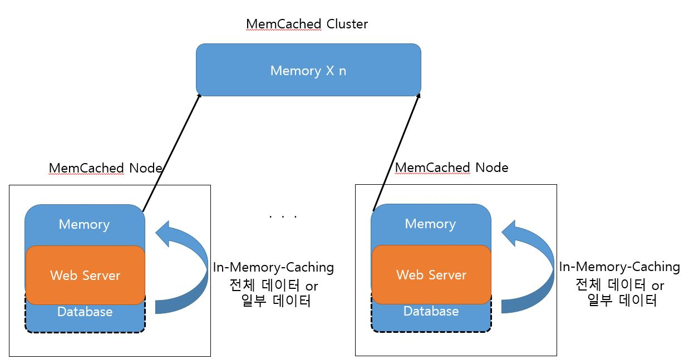

# AWS study - 20190703

> AWS를 직접 사용하여 제품을 구성하기 위해 배워야 할 기초적인 부분을 서술함.

## AWS 스토리지
### 1. S3
> 어디서든 모든 데이터를 저장하고 검색 할 수 있도록 구축된 객체 스토리지. 저장하면 어디서나 url형식으로 해당 데이터를 불러 올 수 있음. Region에 버킷을 생성한 뒤, 해당 버킷에 데이터를 삽입 할 수 있다.

 

### 2. Glacier
> S3와 비슷한 역할을 하지만, 데이터 장기보존에 특화되어있어 데이터 아카이브와 백업의 용도로 주로 사용된다.
	
 - ### 백업
	-------------------
	사고를 대비해여 데이터를 복원할 목적으로 생성하는 Data
	
 

- ### 아카이브
	------------------
	보편적으로 먼 과거의 데이터에서 일부 데이터를 찾기 위해서 생성하는 data

 

### 3. Storage Gateway
> On-Premise 어플리케이션과 클라우드 기반 스토리지를 연결해주는 제품. 백업과 아카이브를 위해 클라우드에 데이터를 업로드 할 수 있으며, 특정 시점을 스냅샷으로 백업 할 수도 있다. 즉, EC2에서 언제든지 사용 할 수 있도록 on-Premise데이터를 미러링 시켜놓는 용도로 사용 될 수 있음. 현재 지원되는 Storage Gateway의 종류는 다음과 같다.

- ### File Gateway
	-------------------
	가장 최근에 사용한 데이터에 엑세스 할 때 지연 시간을 줄이기 위해 로컬 캐시를 사용하여 S3에 파일을 객체 형태로 저장한다.

 

- ### Volumn Gateway
	-----------------------
	Elastic Block Store의 스냅샷을 S3에 저장한다.

- ### Tape Gateway
	-----------------------
	테이프 하드웨어의 데이터를 가상테이프 형태로 S3에 백업 하고 자주 쓰지 않는 데이터들은 Amazon Glacire에 보관할 수 있다.
	
 

### 4. Snowball
> 페타바이트에 이르는 데이터를 빠른 속도로 송수신 하는데 특화된 데이터 전송 솔루션이다. 256비트 AES로 암호화하여 송수신한다. Snowball Edge를 사용하면 네트워크 연결이 불안한 edge에서도 aws cloud를 로컬로 이용 할 수 있다 (찾아보니 엣지 디바이스를 배달해준다고 함).

 

### 5. CloudFront
> 일종의 캐시서버 역할을 하며, Region의 Edge Location에서 content를 캐싱한다. 사용자가 어떤 자원을 요청하였을 때, CloudFront에 해당 자원을 캐싱 하였다면, 캐싱된 자원을 전송하며, 없으면 오리진서버에 자원을 요청하여 사용자에게 전송 후 해당 데이터를 캐싱한다. 이러한 방법을 통해 지연시간을 줄여 빠른 컨텐츠 제공에 도움이 된다.

 

CloudFront에서 사용자에게 콘텐츠를 제공하는 방법은 다음과 같다.

 

	1.  사용자가 웹 사이트 또는 애플리케이션에 액세스하고 이미지 파일 및 HTML 파일 같은 하나 이상의 객체를 요청합니다.
	    
	2.  DNS가 요청을 최적으로 서비스할 수 있는 CloudFront 엣지 로케이션으로 요청을 라우팅합니다. 이 위치는 일반적으로 지연 시간과 관련해 가장 가까운 CloudFront 엣지 로케이션이며, 요청을 해당 위치로 라우팅합니다.
	    
	3.  엣지에서 CloudFront는 해당 캐시에 요청된 파일이 있는지 확인합니다. 파일이 캐시에 있으면 CloudFront는 파일을 사용자에게 반환합니다. 파일이 캐시에  _없으면_  다음을 수행합니다.
	    
	    a.  CloudFront는 배포의 사양과 요청을 비교하고 파일에 대한 요청을 해당 파일 형식에 적절한 오리진 서버(예: 이미지 파일의 경우 Amazon S3 버킷 및 HTML 파일의 경우 HTTP 서버)로 전달합니다.
	        
	    b.  오리진 서버는 파일을 다시 CloudFront 엣지 서버로 보냅니다.
	        
	    c.  오리진에서 첫 번째 바이트가 도착하면 CloudFront가 파일을 사용자에게 전달하기 시작합니다. CloudFront는 다음에 다른 사용자가 해당 파일을 요청할 때 엣지 로케이션의 캐시에 파일을 추가합니다.

- 출처 : [https://docs.aws.amazon.com/ko_kr/AmazonCloudFront/latest/DeveloperGuide/HowCloudFrontWorks.html](https://docs.aws.amazon.com/ko_kr/AmazonCloudFront/latest/DeveloperGuide/HowCloudFrontWorks.html)

## AWS Database

### 1. RDB, dynamoDB
> 각각 관계형 데이터베이스, noSQL을 서비스 하는 제품이다. 특히 dynamoDB같은 경우, ssd스토리지를 사용하여 접근속도가 빠르며, api를 통해 간편한 인터페이스를 제공하고 있음

 

### 2. ElastiCache
> 현재 memcached와 redis 형식의 서비스를 제공하고 있다. 이 제품을 이해하기 위해 먼저 다음을 알아보았다.

  

-  ### In-Memory-Caching Service
	---------------------------
	일반적으로는 데이터베이스(SSD, HDD)에서 필요한 데이터를 쿼리를 사용하여 불러온 뒤 메모리에 적재하는 형식이지만, 이 기술은 데이터 자체를 메모리에 적재하는 형식이다.

 

- ### Memcached
	----------------------
	여러개의 메모리 노드를 논리적으로 하나로 묶어 대용량 메모리처럼 쓸 수 있게 한 오픈소스.   참조 : [https://memcached.org](https://memcached.org/)

 

- ### Redis
	---------------
	String, Hash, List, Set, Sorted Set 등 다양한 데이터 형식을 제공하는 키-값(Key-Value) 형태로 캐시와 메시지 브로커로 사용 할 수 있는 기술이다. 참조 : [https://redis.io](https://redis.io/)
	
	
----------------------------------------
	

현재 AWS에서는 Memcached방식과 Redis방식을 둘다 지원 해주며, 규모가 작은 웹서버 같은 경우에는 Memcached방식, 규모가 크고 복잡한 시스템 같은 경우는 Redis방식을 권장하고 있다. 위 기술을 사용하여 클러스터의 크기를 api형태로 조절이 가능하다.
정리하자면,  ElastiCache를 사용해야 하는 이유는 읽기 중심의 서비스(SNS, 게임 등...), 고속 데이터 분석환경에서 데이터베이스를 부하를 줄이고자 할때, 대용량 분산 캐시 환경을 자체 제작하기 힘들때 구축비용을 줄이는데 있다.
다음은 Memcached기반의 Elasticached구성도이다. (뇌피셜)

  

# Networking

### 1. Virtual Private Cloud (VPC)
> VPC를 사용하여 클라우드 상에서 VPN, 하드웨어 없이 가상 네트워크를 구축 할 수 있다. 나도 모르게 VPC를 사용하고 있었다. 현재 나는 3개의 서버를 운영중인데 이 3개의 서버가 자동으로 VPC로 구성되어있었다.
> ACL를 이용하여 인바운드 ,아웃바운드 엑세스를 제어 할 수 있다.

 

### 2. Route 53
> 아마존에서 제공하는 DNS서비스. 도메인 등록, 수정, 외부 소스로 라우팅, 리소스 상태를 모니터링 할 수 있다.

 

### 3. Direct Connect
> On-Premise환경에서 AWS Cloud로 private 네트워크 연결을 구축 할 수 있는 서비스이다. 그 결과로 네트워크 비용을 줄이고, 대역폭 처리량을 늘리며, 인터넷 기반 연결보다 더 일관된 환경을 구축 할 수 있다.

## AWS 자격증명, 클라우드 보안

### 1. Identity and Access Management (IAM)
> 로그인 하면서 IAM계정 넘버를 입력하라는 부분을 보았다. 계정을 생성 할 시 ROOT권한을 가진 계정을 처음 만들 수 있는데, 이 계정에서 IAM계정을 여러개 만들 수 있다. 만들어진 IAM계정은 ROOT계정에게 권한을 부여받아 해당 권한만 수행 할 수 있다. 

 

### 2. Directory Service
> AWS에 존재하는 리소스를 On-premise MicroSoft Active Directory와 연결하거나, 새로운 독립 실행형 Directory를 설정할 수 있는 관리형 서비스이다.

 

### 3. CloudHSM
> 클라우드 내에서 전용 HSM(하드웨어 보안 모듈) 어플라이언스(전원만 들어가면 바로 쓸 수 있게 하는 것을 말함)를 사용함으로써 데이터 보안에 대한 요구사항을 충족하도록 해준다. 이서비스를 통해 암호화 키 및 HSM이 수행하는 암호화 작업을 제어 할 수 있다.

 

### 4. CloudWatch
> AWS Cloud의 리소스와 어플리케이션을 모니터링 한다. CPU와 네트워크 사용률 같은 시스템 지표와 페이지 로드, 쿼리 실행시간 같은 사용자 정의 지표까지 모니터링 가능하다.

 

### 5. CloudTrail
> 계정에 대한 AWS API호출을 기록하고 로그 파일을 사용자에게 전달하는 웹서비스다.

 

### 6. Config
> 시간에 따른 리소스에 대한 변경을 추적하는 서비스이다. 이 서비스를 이용하여 변경을 적용하기 전에 해당 변경이 어떤 영향을 미치는지 분석도 가능함.

  

##  분석

### 1. Redshift
> 페타바이트 규모의 빠른 완전관리형 데이터 웨어하우스 서비스이다. 로딩 없이 데이터 웨어하우스 쿼리를 데이터 레이크로 확장한다.

-  ### 데이터 레이크
	---------------------------
	기존 기업에서 활용되는 다양한 시스템에서 생성되는 데이터를 담아두고 분석이 필요할 때 사용 되는 데이터 웨어하우스에서 탈피하여 사물인터넷, 소셜미디어, 웹사이트 클릭 스트림 등 다양한 데이터가 분석 대상으로 옮겨감에 따라 이를 위해 등장한 개념이 데이터 레이크이다. 데이터 레이크는 데이터 종류를 ㄹ묻지도 따지지도 않고 저장하는 공간을 말한다. 이러한 데이터는 현재 4차 산업혁명에서 큰 경쟁력이다.

### 2. Elastic MapReduce(EMR)
> 분산 데이터 처리 엔진으로 Apache Hadoop엔진을 사용하며, 이를 통해 방대한 양의 데이터를 간편하고 비용 효율적으로 처리할 수 있는 웹서비스. dynamoDB를 이 서비스로 hadoop과의 통합을 지원함.

 -  ### Apache Hadoop
	---------------------------
	아파치 하둡은 대량의 자료를 처리할 수 있는 큰 컴퓨터 클러스터에서 동작하는 분산 응용 프로그램을 지원하는 프리웨어 자바 소프트웨어 프레임워크이다

 

### 3. Kinesis
> 방대한 규모의 데이터 스트리밍을 실시간으로 처리 할 수 있는 서비스이다.  시간당 수백 테라바이트를 수집 및 처리 할 수 있으며, 사용자는 이를 활용하여 웹 클릭 스트림, 마케팅 등에 활용 할 수 있다.

 

### 4. Athena
> ANSI SQL을 사용하여 S3 데이터를 쉽게 분석 할 수 있도록 한다. 서버리스이므로, 관리할 인프라가 없음.

### 5. EMR
> EC2가 빅데이터 사용을 쉽게 하기 위해 도와주는 서비스

### 6.  QuickSight
> 분석 된 것들을 가시적으로 보여주는 서비스

