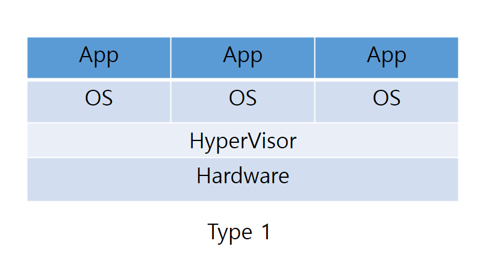
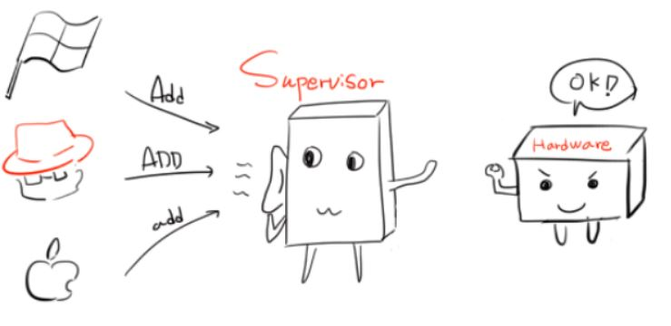
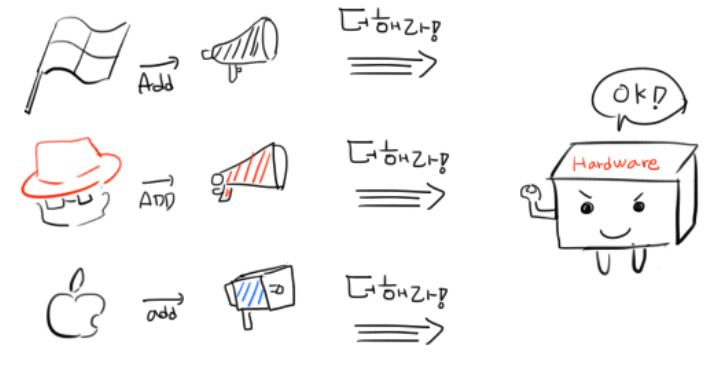
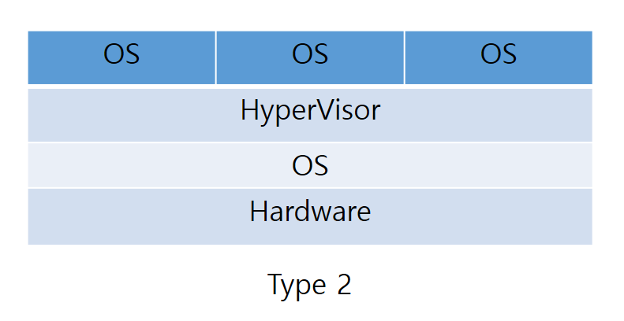


# Virtualization - 20190809
>기존에는 하나의 app이나 task에 하나의 전용서버를 할당하였다. 이렇게 함으로써 app에서 발생하는 문제의 원인을 쉽게 발견 할 수 있었으며, 네트워크 구성이 용이했다. 
>그러나 이는 서버의 능력 중 극히 적은 능력만을 사용하여 효율성이 떨어지고, 네트워크 규모가 커지고 복잡해짐에 따라 서버가 점유하는 물리적 공간이 커지고 그에 따라 전력 소모도 심해진다. 
>이를 해결하고 전략을 세우기 위해 물리서버의 최대 처리능력만큼 여러개의 가상머신으로 분할하여 물리서버의 처리 능력을 최대한 활용 할 수 있게 한 것이 (서버) 가상화이다. 
가상화를 하게 되면, 원래 os와 가상화한 파티션의 os를 다르게 설정 할 수 있다. 이 때, 상이한 os의 명령 또는 동작을 해석하여 하드웨어에 전달해줌으로써 인터페이스를 제공하는 것이 hypervisor이다. 
즉, 위와 같은 역할을 hypervisor가 해줌으로써 widnow상에서 CentOS같은 운영체제를 사용 할 수 있다. VMWare, Parallels같은 것도 hypervisor이다. 
hypervisor는 bare-metal형 hypervisor(type 1), os위에 올려져서 쓰이는 hypervisor(type 2)으로 나뉜다.

의문점 : boot loader같은거도 hypervisor에 속하는가?

Type 1 (Native or Bare-Metal Hypervisor)
----------------------------------------
>하이퍼바이저가 OS에 종속되지 않고, 하드웨어에 직접 설치된다.
보통 OS가 하드웨어를 컨트롤 하지만, type 1방식의 Hypervisor를 절치하게 되면, Hypervisor가 직접 하드웨어를 제어 할 수 있기 때문에 OS의 Overhead가 적어지고, 자원 관리가 유연해진다. 
그러나 Hypervisor 자체에는 별도의 관리기능이 없기 때문에 이 방식에서는 구동 시 DOM0(Hypervisor 구동시 Hypervisor가 실행시키는 도메인)라는 관리 머신이 함께 구동된다. DOM0에서 얼마나 일을 부담하는가에 따라 전가상화, 반가상화로 나뉜다.

 - ### Full-Virtualization (전가상화)
	> 로마에 가면 로마법을 따르는 것 처럼, 각 OS는 고유의 규칙을 가지고 있고 같은 것을 표현하는 방식도 OS마다 틀리다. 각기 다른 표현을 Hypervisor(엄밀히 말하면 DOM0)가 핸들링하여 Hardware가 알아 먹을 수 있는 표현으로 변환 한 다음, Hardware에게 전달한다.

  

[https://blog.naver.com/alice_k106/220218878967](https://blog.naver.com/alice_k106/220218878967) -> 사진 출처 (Alice님 Blog)

 - ### Para-Virtualization (반가상화)
	>전가상화에서는 Hypervisor(엄밀히 말하면 DOM0)가 각기 다른 표현을 번역하여 Hardware에 전달하였지만, 반가상화에서는 표현하는 사람이 직접 하드웨어가 알아먹게 전달하는 방식(Hyper-Call)이다. 즉, 우리가 영어권으로 여행가면 한국어를 안쓰고 영어를 사용하여 대화하는 것과 마찬가지다. 
	 하지만, 기본적으로 커널에는 Hyper-Call에 대한 정보가 없다. 그래서 가상 OS의 커널을 직접 수정해야하는 단점이 있다. 그러나 DOM0를 거치는 횟수가 줄기 때문에 전가상화에 대비하여 좋은 퍼포먼스를 보인다.

  

[https://blog.naver.com/alice_k106/220218878967](https://blog.naver.com/alice_k106/220218878967) -> 사진 출처 (Alice님 Blog)

Type 2
------------------------------------------------
일반적으로 우리가 쓰는 VMWare같은 것과 같다.
Hardware에 OS를 설치하고, 그 위에 Hypervisor를 설치한다.
OS가 Hardware를 관리하기 때문에 DOM0가 필요없다. 그러나 OS위에 Hypervisor가 구동되고 그 위에 가상화가 이루어 지는 방식이기 때문에 Overhead가 크다.

