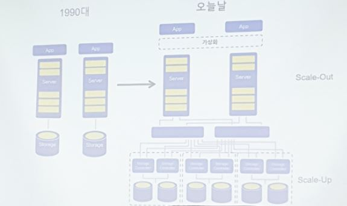
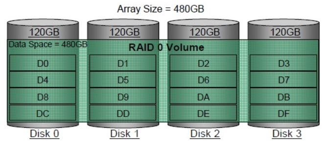
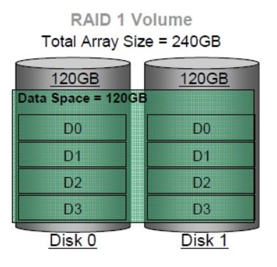
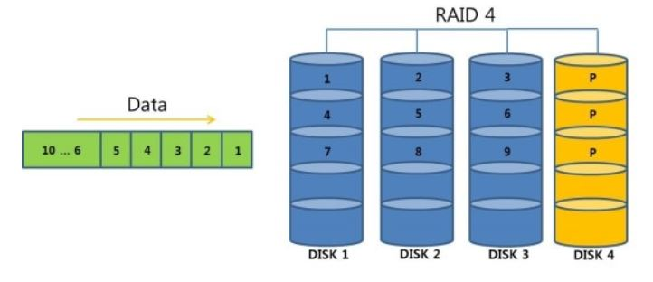
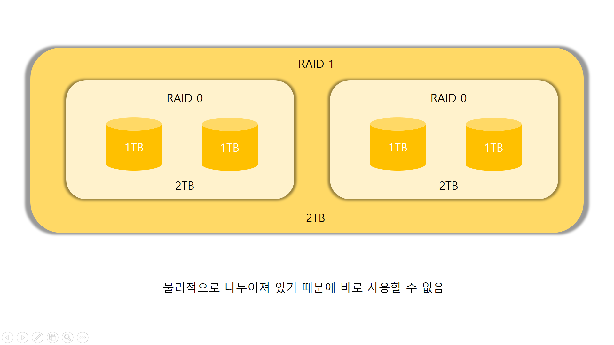
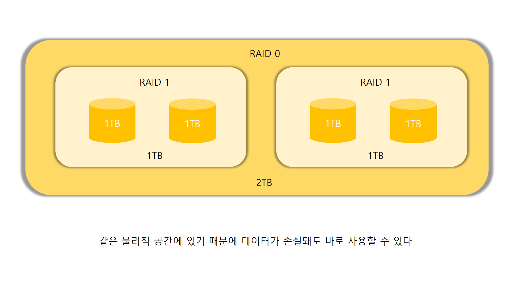

# Infra 20190418

Thanks to [JongYunYi](https://github.com/YIJONGYUN) and JuHyeonLee
#
전체적인 용어 정리

1. 가상화된 시스템의 구성요소
- CPU
- Memory
- 하드디스크
- OS
- 미들웨어(서버관점), 어플리케이션(사용자관점)
- 서비스
#

2. 하이퍼바이저
- 가상화 할때, 하드웨어에 바로 os가 설치되는 것이 아닌 하이퍼바이저가 설치된다. 
- 주된 역할은 가상화된 어플리케이션에 접속 할 수 있게 한다.
 Ex) Hyper-v, VMware, Nutanix ...  
#

3. Cloud 종류
- SaaS (Software as a Service)
클라우드 환경에서 운영되는 어플리케이션 서비스
ex) GMail, 온라인 컴파일러, Dropbox ...  

- IaaS(Infrastructure as a Service)
데이터센터를 구축하는 대신 클라우드를 이용해 필요한 컴퓨팅 인프라를 사용하는 형태
ex) AWS, MS, Google, IBM, Oracle ...
- PaaS (Platform as a Service)
소프트웨어 서비스를 개발할 대 필요한 플랫폼을 제공하는 서비스
ex) 구글 앱엔진, 세일즈포스닷컴 ...  
#

 
 4. 가상화 형태의 종류
- p2v : physical to virtual
- v2v : virtual to virtual
- v2c : virtual to cloud
- p2c : physial to cloud  
#

	
5. 가상디스크를 생성할 때는 물리디스크에 구애를 받지 않는다.
- 실제 디스크가 50G임에도 불구하고 1000G를 할당 할 수 있다. 
- how : 처음부터 다 주는 것이 아니고 쓰는 용량에 따라 조금씩 주면서 50기가를 넘어가면 제공사에서 확장하는 방식이기 때문에 가상디스크는 실제 디스크에 구애받지 않고 할당해줄 수 있다. (Over Commit)  
#

6. Enterprise Intrastructure

단일 서버로 운영되다 가상화를 통해 한 서버에 여러가지 어플리케이션을 탑재할 수 있게 되었다.
하지만, 규모가 기업급으로 커짐에 따라 복잡성이 커졌다.

- 높은 비용 : 여러분야의 기술과 인력이 사용됨에 따라 높은 비용 소모, 예산 예측의 어려움.
- 느린 적용시간, 실제 업무에 적용하기 까지 시간이 오래 걸림
- 관리 복잡성 : 여러앱이 탑재됨에 따라 관리도구의 난립, 수동작업의 증가
- 기술 지원의 어려움 : 다양한 기술의 충돌, 불명확한 책임소재
- 확장성의 한계 : 확장이 자동화되지 못하므로 반복작업 증가

위 같은 복잡성을 해결 한 것이 Hyper Converged Intrastructure이다.  
#

7. Hyper Converged Intrastructure
- 컴퓨팅, 스토리지, 네트워킹을 단일 시스템으로 결합할 수 있다.
- 어플리케이션과 연계된 정책을 기반으로 추상화하고 풀링한 다음, 동적으로 할당한다.
- 모든 데이터 센터 기능은 하드웨어 대신 소프트웨어 계층에서 실행된다.
- 하나의 장비에서 처리하던 일을 여러 장비에 나눠서 처리할 수 있도록 설계되어있음. (Scale out형 확장)  
#

8. Clone과 SnapShot이 차이점
- Clone은 단순히 VM자체를 복사하여 새로운 VM을 만들어내는 것이다. 복사한 VM은 그 자체로 시스템이다.
- 반면 Shapshot은 가상 시스템의 디스크파일 사본이다. 이 자체로 시스템을 구성할 수 없으며, 대신 이것을 기반으로 VM을 복원하는데 탁월하다.  
#

9. 분산/병렬 아키텍처의 장점
- 스토리지 컨트롤러의 분산
- 데이터 처리 경로의 분산
- 관리도구의 병렬처리  
#

# RAID (분산스토리지의 대표적인 예)
Reduntant Array of Indepentdent or Reduntant Array of Inexpensive
여러개의 디스크를 하나로 묶어 하나의 논리적 디스크로 작동하게 하는 기법이다. 

여러 RAID레벨이 있지만, 대표적인 레벨만 설명하겠다.  
#

RAID 0 (Striping)
---------------------------

1. 디스크에 분산된 블록으로 정렬되어 있기 때문에 읽기 및 쓰기가 병렬로 처리 될 수 있다.
2. RAID 0 에서는 중복 정보가 저장되지 않는다. 따라서 하나의 드라이브에 오류가 발생하면 두 드라이브의 모든 데이터가 손실된다.

		장점 : 빠른 I/O, 용량을 모두 활용할 수 있음
		단점 : 낮은 안정성  
		#

RAID 1 (Mirroring)
---------------------------

1. 실시간으로 두개의 하드디스크가 복제되기 때문에 단일 디스크 오류가 발생할 경우 다른 디스크에서 자료를 즉시 불러와서 오류에 대한 극복이 뛰어나다.

2. 두개의 다른 디스크에 같은 정보를 저장하기 때문에 전체적인 용량은 단일 디스크 용량과 같다.

3. Nutaix는 이 방식을 따른다.

		장점 : 높은 안정성
		단점 : 관리 용량 대비 높은 비용  
		#

RAID 4  (Parity)
---------------------------

1. 데이터는 RAID 0 처럼 순차적으로 디스크에 쓰기 때문에 성능 향상의 이점이 있다.

2. RAID 0 의 단점인 안정성을 위해 하나의 디스크를 Parity전용 디스크로 사용한다. 전체디스크가 N개이면, 실제 사용가능한 디스크는 N-1개다.

3. Parity check를 통해 손상된 데이터를 역추적하여 복구가 가능하다.
 
		 장점 : RAID 0 대비 높은 안정성, RAID 1 대비 뛰어난 성능
		 단점 : Parity 디스크에 부하가 걸릴 경우 성능이 저하된다. (병목현상)  
		 #

RAID 5  (Distribute Parity)
---------------------------

1. Parity bit를 분산하여 구성하였기 때문에 RAID 4의 병목현상을 줄일 수 있다.

2. 안정서오가 성능을 어느정도 보장 할 수 있어 가장많이 사용되는 구성되는 방법이다.

3. RAID 4와 마찬가지로 N개의 디스크가 있으면 실제로 사용가능한 디스크는 N-1개이다.

		장점 : RAID 4 대비 병목현상이 줄음, 널리 사용
		단점 : 딱히 없음  
		#

RAID를 이용한 응용 문제 풀이
-----------------------
다음 시스템의 차이점을 설명하시오.

- CASE 1
  
#

- CASE 2
  
#

2번사진에서 하나의 디스크가 다운된다면, RAID 1에서 바로 불러와서 오류를 빠르게극복 할 수 있지만,

1번사진 같은 경우, 디스크가 작은단위에서 RAID 0으로 구성되어 있기 때문에, 상위 RAID 1의 미러링을 통해서 복구를 해야한다. 

 그러므로, CASE 2 보다 훨씬 더 많은 시간이 소요되어 장애시간이 길어진다. 실제로도 CASE 2의 형태로 운영된다고 한다.

