# Oracle DB 공부 일지

풀스택이 되기 위한 사전준비.

## 20190312 - 문자, 숫자, 날짜 데이터 등 다루기

국가교통부에서 실거래가를 공개한다. 이를 Oracle DB에 임포트 시켜 활용해보았다.
link : redown.molit.go.kr

위 링크에서 다음과 같이서울시 전체의 아파트 매매 1년치 정보를 csv파일로 받을 수 있었다.

위 csv파일에 쓸모없는 주석이 있어 notepad++로 삭제 하고 나서야 최종적으로 Oracle DB에 임포트 할 수 있었다.

임포트를 하게 되면 다음과 같이 자동으로 비슷한 형태의 변수형과 크기를 지정해준다.
하지만, 언제까지나 근사변환이므로, 글자수에 맞게 알아서 변환해주었다.
다음은 최종 임포트 결과이다. (table_name -> apt_price)
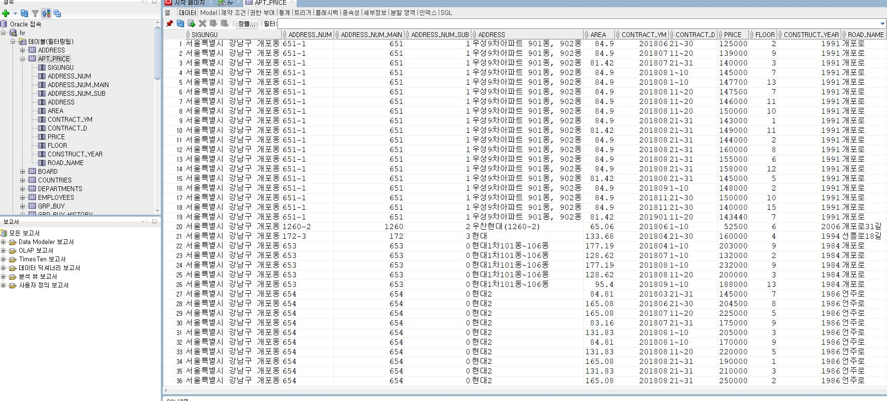

이 많은 데이터를 이용하기 위해서 가장 먼저 해야할 일은 **데이터의 정제**이다.

## 문제1. 구, 동이름을 추출하여 칼럼 생성 후 view로 저장하기
 시군구 컬럼의 데이터들을 보면 **시, 구, 동이 이어진 주소**를 가지고 있었다. 실제 데이터 분석을 가정하고 구와 동을 문자열 다루는 함수를 통해 분리해보기로 하였다.

가장 먼저 규칙을 보았다. 시와 구 동을 구별할 때 띄어쓰기가 되어 있는 점이 눈에 띄었다.
이 점과 수업시간에 배운 특정 문자의 인덱스를 찾는 instr과 문자열의 특정부분만 출력시켜주는 substr를 이용하기로 했다.

먼저 **첫 번째와 두 번째 띄어쓰기 인덱스**를 알아야 했다.
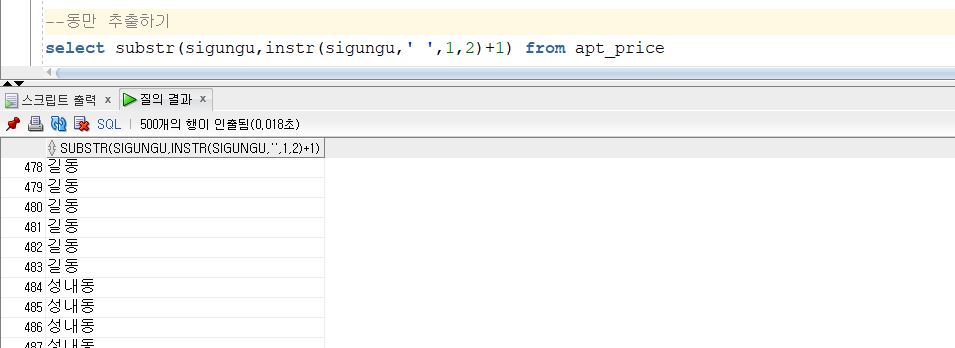
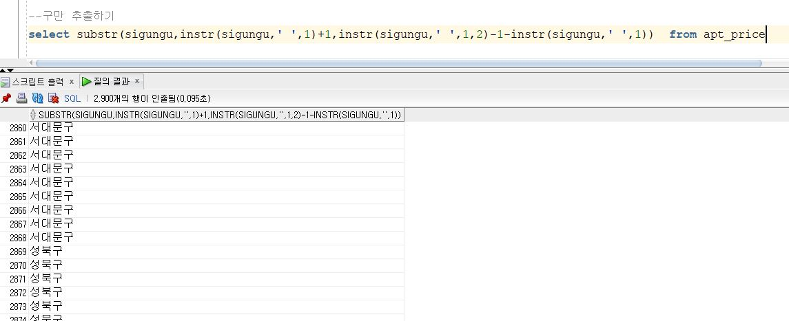
다음과 같은 결과를 얻었다.
첫 띄어쓰기 인덱스부터 다음 띄어쓰기 인덱스의 전까지는 구,
두번째 띄어쓰기 인덱스부터 끝까지 동에 해당하였다. 

이렇게 자른 결과를 기존의 apt_price 테이블과 합쳐 2개의 뷰를 만들었다.
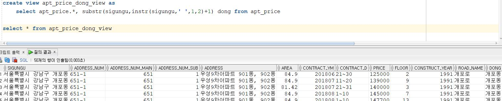
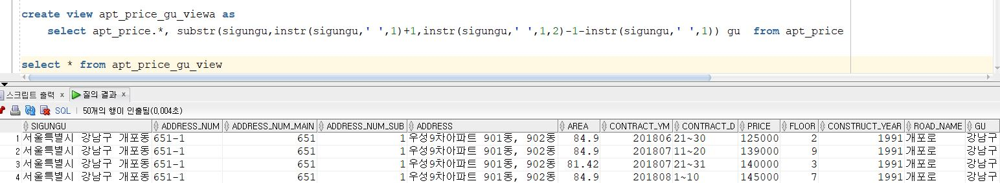

## 문제2~3. area컬럼은 m^2단위이다. 이를 평으로 변환하고, 5평 단위로 출력하라. (ex. 21->20-25)
1평은 약 3.3m^2였다. 이를 이용하여 평방미터를 평단위로 나타낸 다음, 소수점을 버렸다.
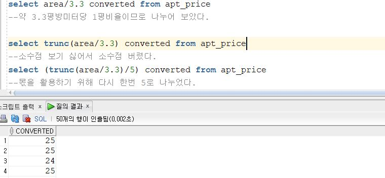

처리를 쉽게 하기 위해 몫을 활용하기로 하였다. 
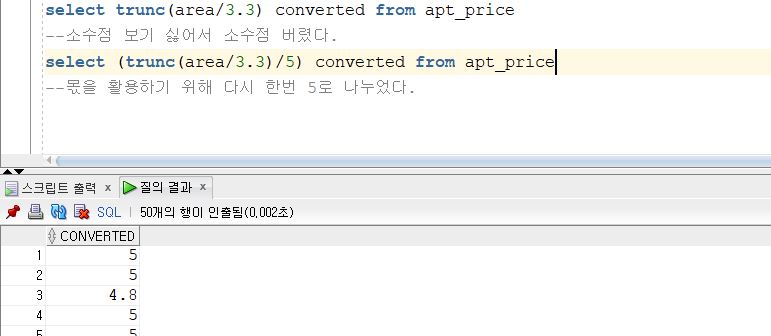

5단위로 끊어야 했으므로, || 연산자를 통해 글자를 이어 붙여 (?평 ~ ?평)의 꼴을 만들었다.
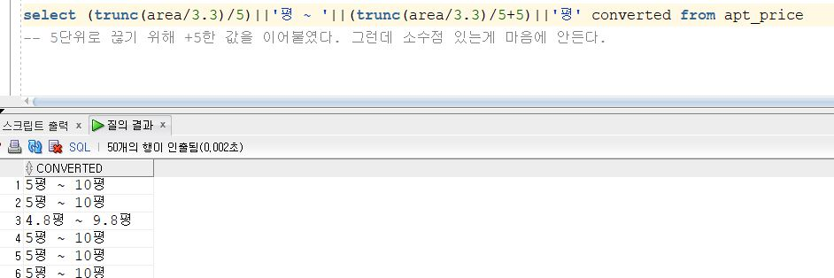

왼쪽 평수를 기준으로 잡고자 다시 한번 5를 나눈 값에 trunc를 해주어 정수로 나누어 떨어지게 해주었다.
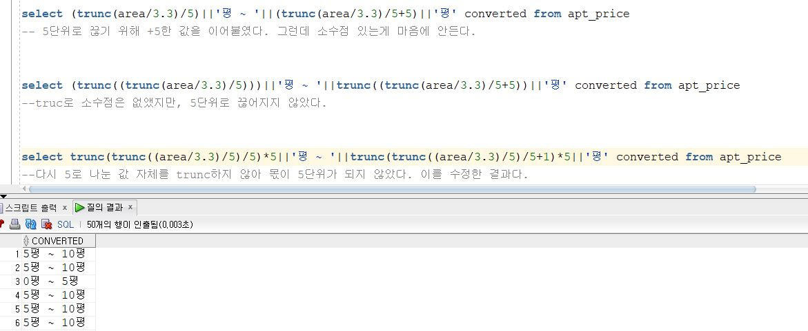

이를 추후 사용하기 위해 view로 만들었다.
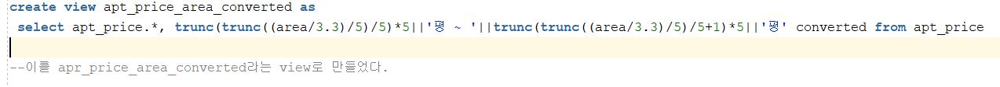

## 문제4. 구별 평형별 매매 평균가를 추출하라.
매우 쉬웠다. 위에서 만들었던 구이름을 추출한 view를 사용하여 구와 평형을 기준으로 출력하면 되었었다.

먼저 기존 테이블에 구와 평형 컬럼을 추가하여 view를 만들었다.
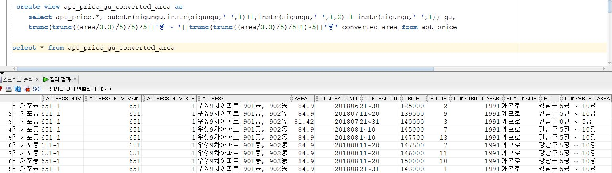

이 뷰를 이용해서 avg()를 이용하여 쉽게 평균값을 추출할 수 있었다.

## 문제5. 구별 평형별 최고가 아파트 top5 추출 -> 문제모호
문제 4에서 만든 view를 이용하여 가장 먼저 구와 평형을 그룹지어 최고가를 추출 할 수 있었다.
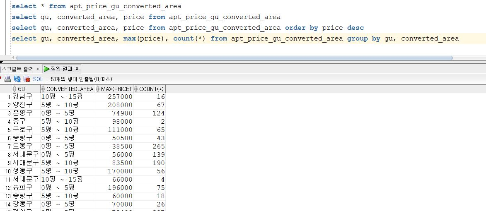

최고가를 알아야 했으므로, 가격의 내림차순으로 정리해보았다.
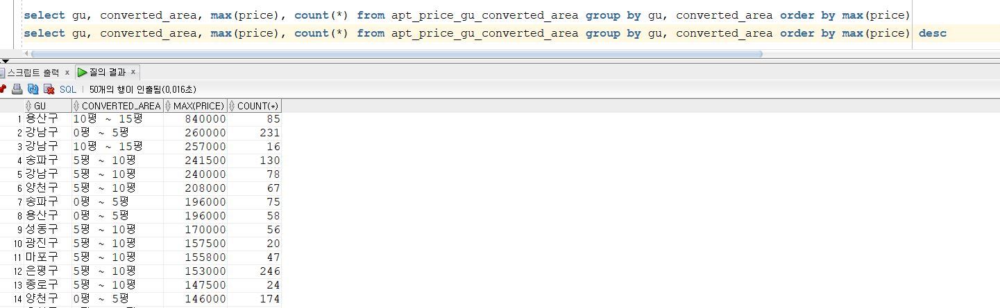

이 결과를 테이블로 다시 사용하여 상위 5개만 출력해보기로 하였다. 이 때, 월욜에 배운 rownum을 사용하였다. 후에 알았는데 이러한 방식의 쿼리가 서브쿼리라는 것을 알게 되었다.
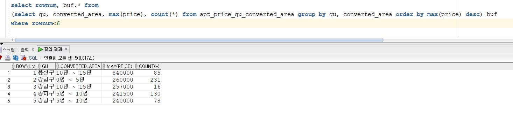

## 문제6. 평당 매매가격이 최고인 아파트 top5 추출
맨 처음 테이블인 apt_price에서 평방미터를 평으로 나타내기 위해 나누기 연산과 반올림을 사용하였다. 또한 평당 가격도 수학을 할 줄 안다면 손쉽게 구할 수 있었다.
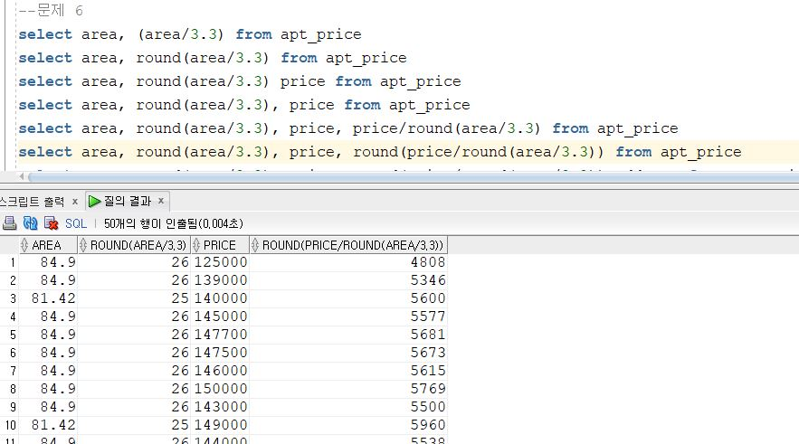

또한 깔끔한 주소를 위한 컬럼을 추가하였고, 내림차순으로 정리하였다.
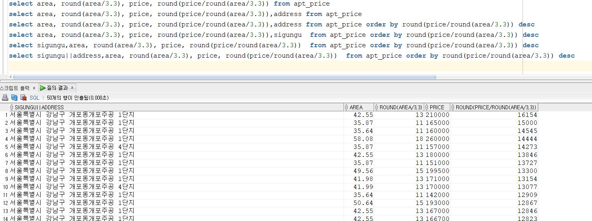

5번 문제와 같은 방법으로 위에서 얻은 테이블을 서브쿼리로 이용하여 상위 5개만 출력하도록 하였다.
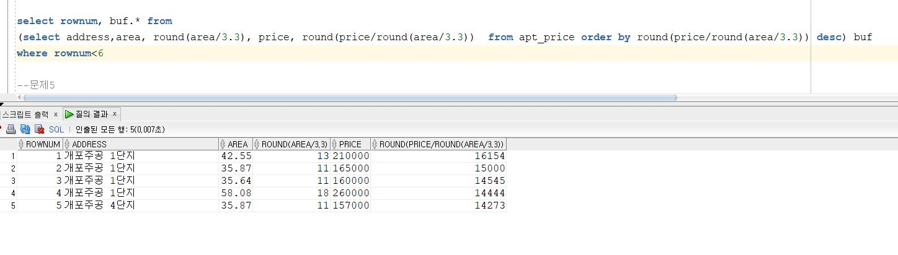

