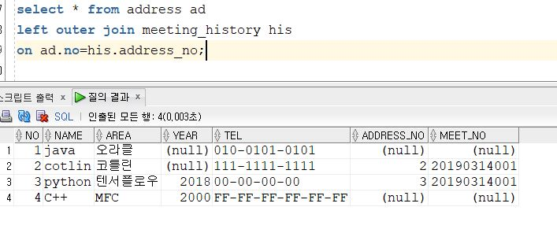
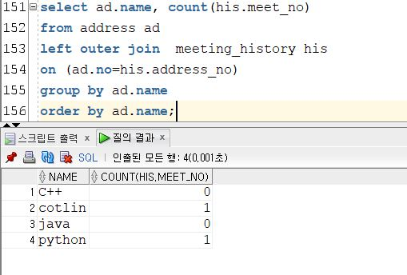
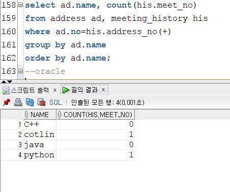
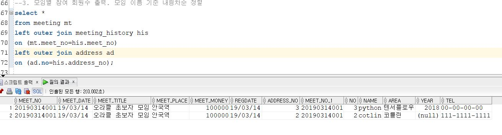
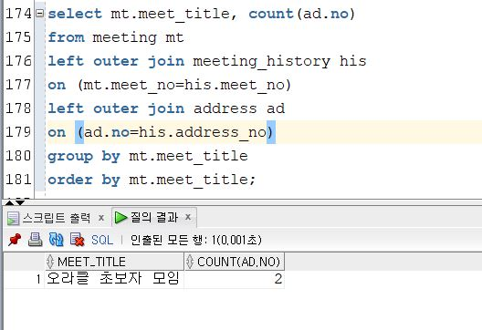
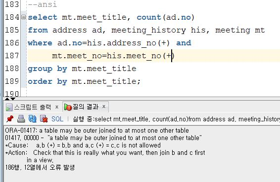
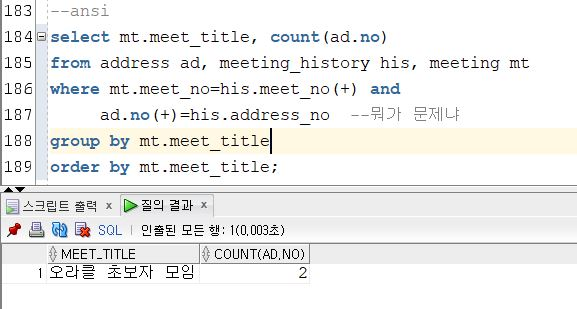
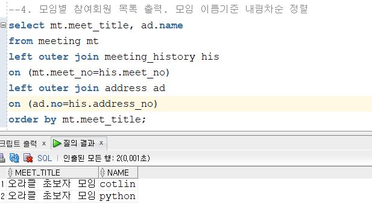
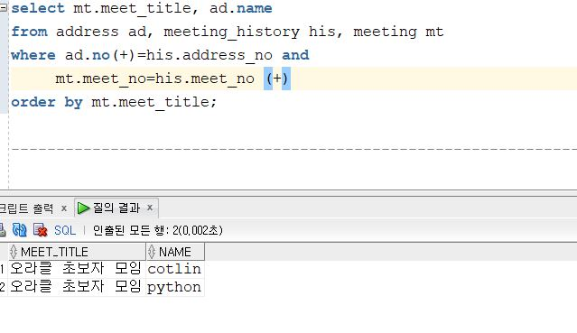

# Oracle DB 공부 일지

풀스택이 되기 위한 사전준비.

## 20190313 - join 문 활용하기

 데이터베이스는 서로 관계가 있는 수많은 테이블로 구성이 되어있다. 서로 관계를 맺고 있는 만큼 데이터를 조회하고 사용할 때도 그 관계를 무시해서는 안된다. 이를 도와주는 역할이 join문이다.
 
 교육 시간동안 느낀 join자체의 역할은 여러개의 테이블을 특정한 조건으로 취합하여 하나의 테이블로 만들어주는 역할이었다.
 하나의 관계를 기반으로 다수의 테이블을 취합하여 의미있고 새로운 데이터를 추출해낼 수 있었다.

각설하고, 조인의 의미를 정리해 보았다.
- 여러 테이블의 데이터를 질의 할 경우를 도와주는 쿼리문
- 하나 이상의 table이나 뷰의 데이터를 row로 결합하여 검색할 수 있는 방법
- 일반적인 경우 primary key나 foreign key 값의 연관에 의해 조인이 성립된다.
- pk, kf의 관계가 없어도 논리적인 값들의 연관만으로 join 작업이 가능하다.

또한 조인은 상황에 따라서 다양한 형태의 조인을 쓸 수 있었다.
각 조인의 종류에 대해 서술해보았다.

- Cross Join
Cartesian product를 얻을 때 사용 된다. A테이블과 B테이블의 데이터 수가 각각 **3개**,**4개**라면, 총 데이터 수는 **12개**를 얻는다.

- Inner Join
**두 테이블 간의 조인조건을 만족하는 row만 출력**한다. 수학으로 치면 교집합과 비슷하다고 느껴졌다.

- Natural Join
 **두 테이블의 동일한 이름을 가지는 칼럼은 싹 다 조인**이 된다. Inner Join의 한 종류라고 볼 수 있다. (Inner Join>Natural Join)

- Join ~ using
Natrual join은 칼럼의 이름이 동일하면 모두 조인이 된다. 이를 보완하여 원하는 컬럼만 조인 할 수 있도록 해준다.

- on 구문을 통해 조인 조건을 지정 할 수 있다.

이들을 이용하여 오늘의 문제도 풀이해 보았다.

주어진 테이블
1. 회원 테이블 address (<U>no</U>,name,area,year,tel)
2. 미팅 현황 테이블 meeting(<u>meet_no</u>, meet_date, meet_title, meet_place,meet_money,regdate)
3. 미팅 기록 meeting_history(<u>address_no</u>,<u>meet_no</u>)

## 문제 1. 회원별 모임참여 횟수를 출력하라. 모든 회원이 이름이 나와야 하며 회원이름을 기준으로 오름차순 정리한다.

이 문제에 대해 생각을 해보자. 회원별 모임참여 횟수를 구하기 위해서는 회원들이 지금까지 참여한 모임의 내역이 기반이 되어야 한다.
- ANSI join
이를 구하기 위해서는 회원 테이블의 no와 미팅기록의 no가 같은 부분을 찾아 join을 하면 기록이 나온다.

이 중에서 address.name당 his.meet_no의 값을 세면 되기 때문에 쿼리는 다음과 같다.

- Oracle Join

## 문제 2. 모임별 참여 회원수를 출력하라. 모임 이름을 기준으로 내림차순 정렬

-ANSI join

미팅 내역은 히스토리와 연관이 있고, 히스토리는 회원의 발자취와 연관이 있기 때문에 세 테이블 모두 outer join을 하여 모임별 참여 회원 리스트를 뽑을 수 있었다.
사

이 데이터에서 모임 이름을 기준으로 회원의 수를 세면 되었기 때문에 쿼리를 다음과 같이 작성하였다.

-Oracle Join
의문점 : 데이터가 부족한 편에 (+)를 사용하면 된다고 했다. 이론대로라면 회원테이블의 no가 history의 회원no보다 더 많고, 미팅이 개최되어도 참여하지 않는 경우가 있으므로 mt.meet_no가 his.meet_no보타 더 많으므로, 쿼리는 다음과 같아야 한다고 생각했다.

그런데 에러가 났다. 일단 문제를 해결하기 위해 (+)조합을 다르게 해보았다.

이렇게 하니까 되던데 이유는 물어보고 다시 서술하겠다.

## 문제 3.  모임별 참여회원 목록을 출력하라. 모임의 이름 기준으로 내림차순 정렬하라.
- ANSI Join
사실 문제 3이 문제 2보다 선행되어야 했다고 생각이 든다. 2-1 사진이 모임별 참여회원의 목록을 포함하고 있었고, 그 테이블에서 필요한 정보만 뽑아 정렬하면 쉽게 풀리는 문제였다.

- Oracle join
이 문제 또한 (+)의 조합이 내 생각과 틀렸고, 조합을 다르게 한 결과, 위 결과와 같은 결과를 얻을 수 있었다. 이 부분에 대한 설명이 필요하다.

## 회고록
내가 문제 2번과 3번에 겪었던 문제에 대해 서술하겠다. 
먼저 모임이 있지만, 아무도 참석을 하지 않는 경우가 있다. 그러하므로 관계는
**mt.meet_no>his.meet_no**의 관계를 가진다. 그러므로 조인의 형식은
mt.meet_no = his.meet_no(+)가 된다.

meeting 테이블에 대해 조인을 거치게 되면 history테이블에는 많은 null값이 생길 것이다. 조인된 테이블에 다시 address테이블을 조인 시키는데 이 때, 전에 서술한 mt.meet_no = his.meet_no(+)의 관계로 인해 null값을 가진 행이 많이 생겨날 것이다. 이 행들에 대해 address테이블도 null값을 생성하기 때문에 관계는
his.meet_no = ad.no(+)가 적용된다.

성윤이형이 알려주신 꿀팁 : history 테이블은 meeting테이블에 종속적이고, history테이블은 address테이블에 종속적이므로 address테이블은 meeting테이블에 종속적으로 이미 조인 된 상태라고 말씀하셨다. 그래서 (+)기호를 쓰지 않아도 작동을 하였다.
  
