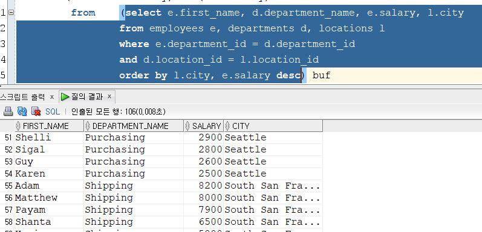

# Oracle DB 공부 일지

풀스택이 되기 위한 사전준비.

## 20190314 - Set 연산자와 Sub Query

 어제 Query의 결정체라고 할 수 있는 join에 대해서 학습해 보았다. join은 테이블간 중복되는 열을 기준으로 새로운 데이터를 만드는데 쓰였는데 set연산은 join과 비슷하면서도 다른 느낌이었다.[

먼저 배운 set연산자에 대해 정리해보았다.

## SET 연산자

- INTERSECT
첫 번째 질의와 두 번째 질의에 **동시**에 해당하는 행을 표시한다.
수학으로 따지면 **교집합**과 비슷한 개념이다.

- UNION
첫 번째 질의와 두 번째 질의에 해당하는 중복을 허용하되, 중복되는 행은 한번만 표시한다.
수학으로 따지면 **합집합**과 비슷한 개념이다.

-UNION ALL
 첫 번째 질의와 두 번째 질의에 해당하는 중복을 허용하는 모든 행을 표시한다.
 수학으로 따지면 **중복을 허용하는 합집합**과 비슷한 개념이다.

- MINUS
두 번째 질의에서 선택되지 않은 첫 번째 질의에 의해 선택된 모든 유일한 행을 표시한다.
수학으로 따지면 **차집합**과 비슷한 개념이다.

set 연산을 할 때 주의해야 할 점이 있다. 살펴보도록 하자.

- 집합 연산자를 사용하기 위해서 select절의 컬럼수가 동일해야하며, 데이터 타입이 상호 호환 가능해야한다.
- 모든 set연산자는 같은 우선순위를 가진다.

## Sub Query 1. 부서가 속한 도시의 소속 부서 갯수를 출력하라.

서브 쿼리를 쓰는데에 어려움을 겪어 따로따로 출력해보기로 하였다. 

- 먼저 각 부서별로 속한 도시를 구해보기로 하였다. 이를 위해 inner join을 사용하였다.

이 테이블에서 도시를 기준으로 부서를 세면 원하는 해답을 얻을 수 있었다.

## Sub Query 2. 각 부서별로 최고 연봉을 받는 사람을 출력하라.
먼저 부서에서 어떤 연봉을 받는지 보기로 하였다. (직원 테이블에서 바로 부서 이름을 찾을 수 없어서 부서 코드로 찾았다.)

이 테이블에서 연봉의 최대값을 부서 아이디 기준으로 구해보기로 하였다.

부서코드별 최고 연봉 테이블과 부서의 이름이 있는 테이블을 지금까지 나온 조건을 모두 만족하는 조이ㄴ을 실행ㅎㅏ여 최종적으로 각 부서별로 최고 연봉을 받는 사람들의 명단을 얻을 수 있었다.

## Sub Query3. 도시별 최고 월급자들의 이름과 월급, 부서명 출력

모든 직원의 연봉과 부서, 위치를 한눈에 보기 위해 employee, departments, locations 테이블을 모두 조인하여 도시와 연봉으로 정렬 한 결과를 먼저 도출해내었다.

이 테이블에서 도시를 기준으로 연봉의 max값을 구한 결과, 각 도시별 최고 연봉을 얻을 수 있었다.

이 테이블에서 지금까지 나온 조건을 모두 만족하며, 현재 사는 도시와 연봉정보 까지 맞는 사람을 찾는 방식으로 각 도시별로 최고 연봉자의 정보를 출력 할 수 있었다.

