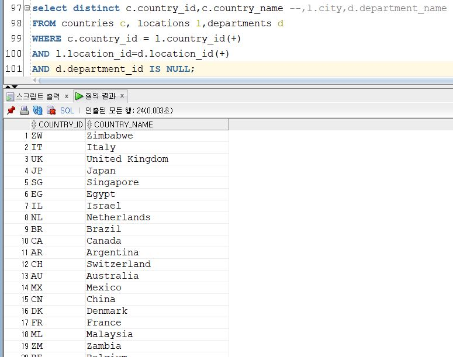

# Oracle DB 공부 일지

20190315 문제풀이 및 회고

## 후기 및 회고
예상 시간보다 시간이 많이 걸렸으며, 문제를 이해하는데 아직 시간이 많이 소요되고 있다. 그리고 한 쿼리로 해결하는 능력이 부족하여 여러번의 select문을 사용하고 있다. 더욱 많은 경우를 경험하여 한 쿼리해결 할 수 있도록 노력하자. 

--------------------------------------------------------------------------------
## 문제 1. 부서별로 job_title에 'manager'가 포함된 직책을 가진 직책 코드, 직책명, 직원들의 수를 출력하는 SQL문을 작성하시오. 없는 부서는 없음이라고 표시하시오.

이 문제가 가장 어려웠다고 생각이 된다. 문제 해석이 난해했고, manager가 없는 부서도 표기하라 해서 어렵게 느껴졌던거 같다.

- 먼저 jobs 테이블과 employees 테이블을 조인하여 like ''%Manager%'를 이용해 Manager 직책을 가진 사람들의 수를 조사해보았다.

  다음 이 테이블과 departments, employees 테이들에서 필요한 정보를 더한 'job_cnt_dept'테이블을 만들었다.
 
  
  job_cnt_dept 테이블과 outer join을 하여 Manager 글자가 없는 사원들만 있는 부서는 '없음'이라고 표시하게 하였다.
  

## 문제 2. 각 부서 내 직책 별 가장 작은 월급을 받는 직원의 이름, 부서명, 직책명, 근무도시 이름을 출력하는 SQL문을 작성하시오. 월급 기준 내림차순으로 출력하시오.

 - 나의 첫 풀이 -> 문제를 제대로 읽지 않아 부서별 가장 적은 월급을 받는 직원을 구했다.

    먼저 각 부서별로 받는 월급을 구했다.
  

    구한 다음 부서를 기준으로 월급의 minimum 값을 구할 수 있었다.
  

	이 값들을 기반으로 테이블 간 기본키, 외래키 관계를 모두 만족하는 값들을 찾은 결과 다음과 같이 부서별 최저월급을 받는 사람을 알아낼 수 있었다.
	

   하지만 여기서 부서 내 직책별로 minimum값을 계산하지 않아 다음과 같이 조건을 추가해 준 결과 문제의 의도에 맞게 값을 얻을 수 있었다.
   

 - 모범답안과의 비교
 모범답안은 각 부서별로 받는 월급의 현황 조회와 minimum 값을 한꺼번에 계산했다. 그 결과, 실행시간에서 내 코드보다 큰 효율을 보였다.
 
   

## 문제 3. 근무 직원의 수가 5명 이하인 도시의 이름과 소속 직원들의 이름, 부서명을 출력하세요.

 - 나의 풀이

   먼저 도시별 직원들의 현황을 알기 위해 다음과 같이 employees, locations, departments 테이블을 모두 조인하였다. 
  

   다음, 조인한 테이블에서 각 도시별로 직원을 카운트 하였다.
   

   카운트 숫자가 6 미만인 행만 출력시키고,
   

   이 조건을 만족하는 도시, 직원 이름, 부서를 출력하게 하였다.
   
                                                                                                                                                                                                                                                                                                                                                                                                                                                                                                                                                                                                                                                                                                                                                                                                                                                                                                                                                                                                                                                                                                                                                                                                                                                                                                                             

 - 강사님 풀이 해석
    도시의 직원 수가 6 미만인 도시를 하나의 select문에 구현하셨다. 불필요한 컬럼이 많기 때문에 나보다 실행시간이 길었다.
                                                           

## 문제 4. 부서가 없는 국가의 id와 이름을 출력하시오. 국가 이름 기준 오름차순으로 출력하세요.

  - 나의 첫 풀이
    outer join을 하여 부서가 없는 국가는 null로 표기되도록 하였다.
    

    여기서 부서가 없는 국가를 구해야하는데 나라 이름이 null인 부분을 구했다. 
    

   원래 문제에서 요구하던 것을 반영하여 내 첫 답안을 수정하면,
    

  다음과 같이 답을 얻을 수 있다.

  - 강사님 풀이 해석
    내풀이에 비해 강사님은 모든 계산 과정을 한번에 처리하셨다. 훨씬 가독성이 좋고 코드 길이도 짧다.
     

## 문제 5. 직책이 변하지 않은 직원들의 이름과 직책 명을 출력하시오. job_history문을 참고하고 이름기준 오름차순으로 출력하시오.

  - 나의 풀이
    먼저 job_history와 employees 테이블을 outer join시켜 직책 변경 여부를 나타내어보았다.
     

	그 다음, 직책이 바뀐 적 없다는 표시인 null 데이터를 가지고 있는 직원만 추출해내었다.
	 

	이 사번과 일치하는 사람들의 신상정보를 다음과 같이 나타 낼 수 있었다.
	 
  
  - 강사님 풀이 해석
	역시 내가 3번의 select문을 거친 작업을 한 select문에 구현을 하였다.
	 

## 문제 6. 자신보다 늦게 입사했으나 월급이 많은 직원이 존재하는 직원의 이름을 출력하는 SQL문을 작성하세요. 월급 기준 내림차순으로 출력하시오.

  그냥 얼핏 보기엔 어려워 보였지만, 자세히 생각해보면 쉬운 문제였다. 이 문제는 단순 employees 테이블만 사용하여 C++처럼 생각하면 2중 for문을 돌리는 느낌으로 접근하니 매우 편하였다.
  
  단순히 테이블 두개를 두고 고용날짜와 월급을 비교하여 출력하면 끝이었다.
   

  이를 조인말고 서브쿼리로도 한번 풀어보았다.
  
